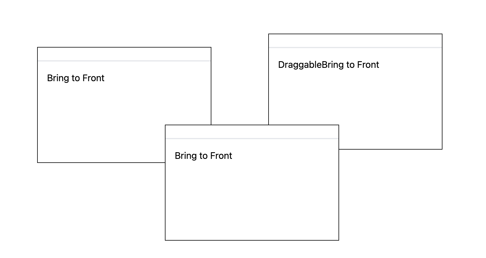

### Aug 14, 2024

Finish window free drag functionality. Z-index should be handled next step as a window controller stack is needed to track all windows generated.  
The window component should separate from the stack/array module, the module should exposure a function that handle gloabl windows. consider create a sys folder and define sth that can be imported to window components, when user click one window, it will be switch to the top of the stack/array

### Aug 16, 2024

Finish window bring to front functionality. In React functional component, we should aware of the 'stale state' problem, it may cause by the component dynamical initialization which may form a 'closure'.
In WindowManager.tsx, I gave up using function to dynamically create components, and switch to the traditional way, to render the component in the return statement.

This version also has a bug. When click 'bring to front' inside each create component, the position of the clicked window did not persist during re-render, and the text inside the window clicked also changed during re-render.

